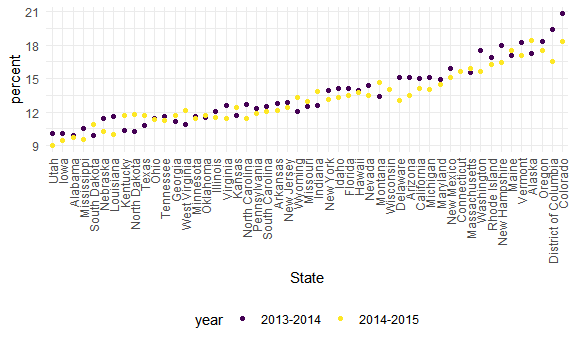
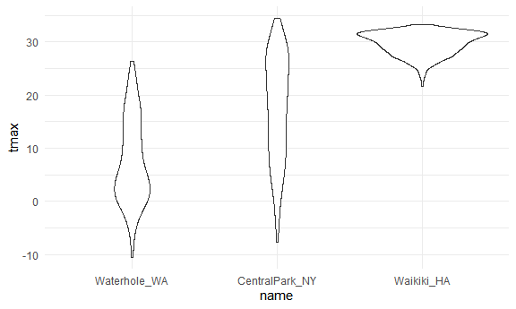

Strings and factors
================

## Strings and regex (regular expression)

``` r
string_vec = c("my", "name", "is", "jeff")

str_detect(string_vec, "jeff")
```

    ## [1] FALSE FALSE FALSE  TRUE

``` r
#Strings are case sensitive
str_replace(string_vec, "jeff", "Jeff")
```

    ## [1] "my"   "name" "is"   "Jeff"

``` r
string_vec = c(
  "i think we all rule for participating",
  "i think i have been caught",
  "i think this will be quite fun actually",
  "it will be fun, i think"
  )

str_detect(string_vec, "^i think") #Carrot is for beginning of line
```

    ## [1]  TRUE  TRUE  TRUE FALSE

``` r
str_detect(string_vec, "i think$") #End of line
```

    ## [1] FALSE FALSE FALSE  TRUE

``` r
string_vec = c(
  "Y'all remember Pres. HW Bush?",
  "I saw a green bush",
  "BBQ and Bushwalking at Molonglo Gorge",
  "BUSH -- LIVE IN CONCERT!!"
  )

str_detect(string_vec,"[Bb]ush") #[] for either or in string 
```

    ## [1]  TRUE  TRUE  TRUE FALSE

``` r
string_vec = c(
  '7th inning stretch',
  '1st half soon to begin. Texas won the toss.',
  'she is 5 feet 4 inches tall',
  '3AM - cant sleep :('
  )

str_detect(string_vec, "^[0-9][a-zA-Z]")
```

    ## [1]  TRUE  TRUE FALSE  TRUE

``` r
string_vec = c(
  'Its 7:11 in the evening',
  'want to go to 7-11?',
  'my flight is AA711',
  'NetBios: scanning ip 203.167.114.66'
  )

str_detect(string_vec, "7.11") # . is a special character indicating anything else, 
```

    ## [1]  TRUE  TRUE FALSE  TRUE

``` r
#If you actually want to capture . have to use \.
```

``` r
string_vec = c(
  'The CI is [2, 5]',
  ':-]',
  ':-[',
  'I found the answer on pages [6-7]'
  )

str_detect(string_vec, "\\[")
```

    ## [1]  TRUE FALSE  TRUE  TRUE

## Factors

``` r
vec_sex = factor(c("male", "male", "female", "female"))

vec_sex
```

    ## [1] male   male   female female
    ## Levels: female male

``` r
as.numeric(vec_sex)
```

    ## [1] 2 2 1 1

What happens if I relevel some of these?

``` r
vec_sex = fct_relevel(vec_sex, "male")
```

## NSDUH – strings

``` r
url = "http://samhda.s3-us-gov-west-1.amazonaws.com/s3fs-public/field-uploads/2k15StateFiles/NSDUHsaeShortTermCHG2015.htm"

tabl_marj = 
  read_html(url) %>% 
  html_nodes(css = "table") %>% 
  first() %>% 
  html_table() %>% 
  slice(-1) %>% 
  as_tibble()
```

``` r
data_marj = 
  tabl_marj %>% 
  select(-contains("P Value")) %>% 
  pivot_longer(
    -State, 
    names_to = "age_year",
    values_to = "percent"
  ) %>% 
  separate(age_year, into = c("age", "year"), sep = "\\(") %>% 
  mutate(
    year = str_replace(year, "\\)", ""),
    percent = str_replace(percent, "[a-c]$", ""),
    percent = as.numeric(percent)
  ) %>% 
  filter(!State %in% c("Total U.S.", "Northeast", "Midwest", "South", "West"))
```

## NSDUH – factors

``` r
data_marj %>% 
  filter(age == "12-17") %>% 
  mutate(State = fct_reorder(State, percent)) %>% 
  ggplot(aes(x = State, y = percent, color = year))+
  geom_point()+ 
  theme(axis.text.x = element_text(angle = 90, vjust = 0.5, hjust=1))
```



## Weather Data

``` r
weather_df = 
  rnoaa::meteo_pull_monitors(
    c("USW00094728", "USC00519397", "USS0023B17S"),
    var = c("PRCP", "TMIN", "TMAX"), 
    date_min = "2017-01-01",
    date_max = "2017-12-31") %>%
  mutate(
    name = recode(
      id, 
      USW00094728 = "CentralPark_NY", 
      USC00519397 = "Waikiki_HA",
      USS0023B17S = "Waterhole_WA"),
    tmin = tmin / 10,
    tmax = tmax / 10) %>%
  select(name, id, everything())
```

    ## Registered S3 method overwritten by 'hoardr':
    ##   method           from
    ##   print.cache_info httr

    ## using cached file: C:\Users\matth\AppData\Local\Cache/R/noaa_ghcnd/USW00094728.dly

    ## date created (size, mb): 2020-10-08 14:54:57 (7.54)

    ## file min/max dates: 1869-01-01 / 2020-10-31

    ## using cached file: C:\Users\matth\AppData\Local\Cache/R/noaa_ghcnd/USC00519397.dly

    ## date created (size, mb): 2020-10-08 14:55:47 (1.703)

    ## file min/max dates: 1965-01-01 / 2020-03-31

    ## using cached file: C:\Users\matth\AppData\Local\Cache/R/noaa_ghcnd/USS0023B17S.dly

    ## date created (size, mb): 2020-10-08 14:56:24 (0.882)

    ## file min/max dates: 1999-09-01 / 2020-10-31

``` r
weather_df %>% 
  mutate(name = fct_reorder(name, tmax)) %>% 
  ggplot(aes(x = name, y = tmax))+
  geom_violin()
```

    ## Warning: Removed 3 rows containing non-finite values (stat_ydensity).



``` r
weather_df %>% 
  mutate(name = fct_reorder(name, tmax)) %>% 
  lm(tmax ~ name, data = .)
```

    ## 
    ## Call:
    ## lm(formula = tmax ~ name, data = .)
    ## 
    ## Coefficients:
    ##        (Intercept)  nameCentralPark_NY      nameWaikiki_HA  
    ##              7.482               9.884              22.176
